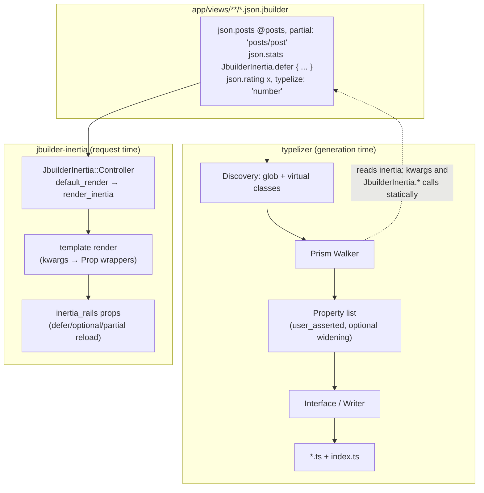
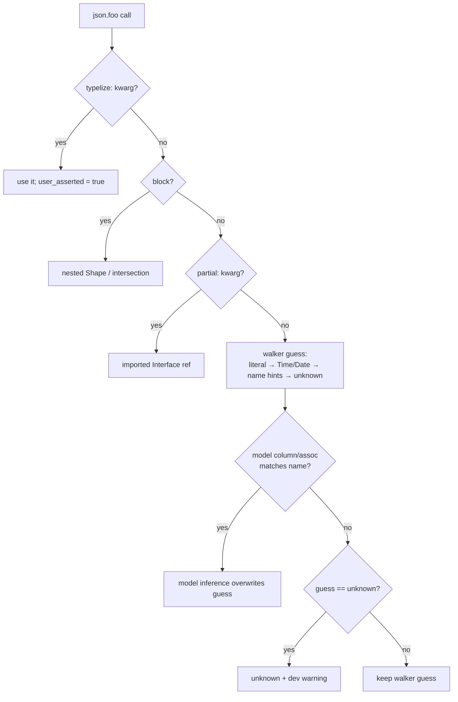

# feat: Productionize the Jbuilder plugin and rewrite jbuilder-inertia

**Target repos:** `typelizer` (this repo; Phases A and C) and `jbuilder-inertia` (sibling repo at `../jbuilder-inertia`; Phase B). All paths are relative to the unit's target repo.

## Summary

Harden the `worktree-jbuilder-plugin-spike` branch into a shippable Typelizer Jbuilder plugin, and rewrite the jbuilder-inertia gem's internals while keeping its `inertia:` kwarg surface. The two gems share one frozen contract: the Typelizer walker reads Inertia prop directives statically and widens deferred/optional props to optional TypeScript types; jbuilder-inertia interprets the same directives at runtime. Nothing ships publicly from this plan — releases, the inertia-rails issue #133 reply, and announcements are gated on explicit approval.

---

## Problem Frame

The spike validated the approach end-to-end (51 templates migrated against a 60+ resource production app, generated shapes structurally matching Alba output), and prior-art research confirmed jbuilder→TypeScript is unoccupied territory with explicit demand (inertia-rails #133, props_template #16). But the spike is not shippable: it breaks boot for every non-jbuilder Typelizer user (unconditional `require "prism"`; ungated `require "jbuilder/jbuilder_template"` in the Railtie), silently drops `unless/else` branches from generated types, relies on a class-mutating override registry that leaks across nesting levels, and has a stale-cache dev loop. The jbuilder-inertia POC has the right DSL but its lazy-evaluation replay hack (lambdas re-entering a dead builder via `__send__` into jbuilder privates) breaks on `cache!`, root `array!`, and double-set keys — and the resolver-object form that would make laziness honest was never built. Separately, the spike's planned resolver-object form is invisible to the walker's kwarg-based widening, which would make the generated types lie for the recommended lazy spelling.

---

## Requirements

**Plugin correctness and safety**

- R1. Typelizer with the Jbuilder plugin loads cleanly for non-jbuilder users on every CI Ruby (3.0–4.0) with neither `prism` nor `jbuilder` installed; no new gemspec runtime dependencies.
- R2. The walker emits no silently wrong types: `unless/else` else-branches are preserved; skipped constructs (`merge!`, dynamic `set!`, unresolvable partials) log warnings through the configured logger; the `unknown` fallback warns in development with file:line.
- R3. A `typelize:` assertion wins over model inference without mutating the serializer class, and is scoped to its nesting level (a nested `total` override must not affect a top-level `total`).
- R4. Dev loop: adding, editing, renaming, or deleting a template (or a partial it composes) is reflected on the next generation without a server restart; `app/views` jbuilder files participate in listen-mode watching.
- R5. Production boot performs no template discovery or parsing; render-time annotation helpers are no-ops; a template carrying `typelize:` or `inertia:` kwargs renders correctly in every supported gem-presence combination (the missing gem's vocabulary is stripped with a one-time warning, never a crash).

**Cross-gem contract**

- R6. Deferred/optional Inertia props widen to optional in generated TS for both the kwarg form (`inertia: :defer`) and the resolver-object form (`JbuilderInertia.defer { }`).
- R7. Behavior is identical regardless of the order the two gems' `JbuilderTemplate` patches are prepended.

**jbuilder-inertia rewrite**

- R8. The `inertia:` kwarg vocabulary is preserved (defer/optional/merge/always/once/scroll plus their option hashes); an invalid `inertia:` value raises or warns instead of silently vanishing.
- R9. Laziness comes from resolver-object and block forms; partial reloads (`?only[]=`) skip evaluation of wrapped props; the replay machinery is removed; `lazy_by_default` is deprecated with a migration note.
- R10. Runtime guards: a root `array!` template rendered as Inertia props and a wrapped prop inside `cache!` both produce actionable errors; `default_render` only intercepts Inertia requests; templates work under Rails strict locals.
- R11. Integration specs exercise real partial reloads, exceptions inside deferred blocks, dual-mode (API + Inertia) templates, and both patch prepend orders.

**Migration and upgrade**

- R12. All fingerprint-affecting changes land in a single release with a CHANGELOG note and a `typelizer:types:refresh` instruction (one digest churn, not several).
- R13. Staged migration is supported: jbuilder templates can emit through a dedicated writer/output namespace, and cross-plugin type-name collisions (Alba `Post` vs jbuilder `Post`) are detected at generation time with a warning naming both sources.

**Documentation**

- R14. `docs/guides/jbuilder.md` matches the implemented heuristics exactly (no claims of unimplemented warnings or collection methods); `docs/getting-started.md`'s "jbuilder users need a serializer library first" sentence is corrected; new config keys are documented in `docs/reference/configuration.md`.

---

## Key Technical Decisions

- **Keep main's middleware; drop the spike's railtie regression.** The spike deletes `lib/typelizer/middleware.rb` and reverts to eager `to_prepare` generation — main hardened that middleware in 0.13. Reconciliation keeps main's request-deferred generation and wires jbuilder re-discovery into it.
- **Prism and jbuilder stay out of the gemspec.** House rule: optional integrations are never runtime dependencies (alba/AMS/panko precedent). Prism loads via lazy activation (`gem "prism", ">= 1.0"` then `require` at first plugin use, mirroring the listen gating in `lib/typelizer/listen.rb`), with a friendly error naming the requirement when activation fails. `prism >= 1.0` is required outright — Ruby 3.3's bundled prism 0.19 lacks `IfNode#subsequent`, and the spike's `respond_to?` degradation is the suspected root of the silent branch loss; dual-API support is not worth carrying.
- **Virtual classes stay; `register_source` is deferred.** `docs/brainstorms/plugin-system.md` names a `register_source` API as the eventual home for non-class sources, with the jbuilder Interface as its likely "second consumer". The spike's virtual-class bridge works with zero new public API; keep it, keep its duck-type surface minimal, and migrate when `register_source` ships (~0.16 per `planned-features.md`).
- **`user_asserted` becomes a `Property` struct member.** Replaces the class-mutating `_typelizer_attributes` side channel. Added to the fingerprint exclusion list alongside `column_type` (it informs inference, not output), per the add-only Property stability rule locked in 0.13.
- **Types are emitted only in today's forms.** Symbols, strings (through `TypeParser`), arrays, `Shape`, `Interface` refs — never plugin-private type objects. This is the no-two-tier-representation rule from `docs/brainstorms/type-dsl.md`, and keeps the plugin covered by the future Stage-1 `Typelizer::Type` sweep.
- **Each gem strips its own vocabulary unconditionally; the foreign vocabulary only when the owning gem's patch is absent.** The vocabularies are not symmetric: `typelize:` is render-inert (strippable by anyone, anywhere), but `inertia:` is render-active — if typelizer stripped it unconditionally and its patch landed outermost, jbuilder-inertia would never see the directive and props would silently render eager while the TS says optional. The absence check happens lazily at strip time (memoized `JbuilderTemplate` ancestor check), never at railtie-install time, because `on_load(:action_view)` callback order between two gems follows require order that neither controls. Two structural rules make prepend-order independence (R7) hold by construction: (a) every patch strips foreign-inert kwargs at the top of `set!`, before any intercept or early return; (b) both gems' `method_missing` overrides (each forced by jbuilder's `alias_method :method_missing, :set!` quirk) forward identically as `set!(name, *args, **kwargs, &block)`, since only the outermost ever executes.
- **Laziness is value-is-directive.** `JbuilderInertia.defer { }` / `optional` / `merge` / `once` / `scroll` resolver objects are the lazy path (Laravel v2+ precedent; the block is the value, so laziness is structural). The `inertia:` kwarg form remains as sugar over the same wrappers. `lazy_by_default` and the builder-replay machinery are removed — top-level auto-laziness was only ever real for block-form props.
- **Top-level `JbuilderInertia` namespace.** Only the prepended template module lives under jbuilder's `BasicObject` hierarchy; Configuration, Controller, Railtie, and PropBuilder move out, eliminating the `::`-ceremony and the Resolver extraction.
- **Parse cache is content-keyed.** Template source digest, not mtime — matching the writer's fingerprint-digest house style — with cascade invalidation: a changed partial invalidates parents that compose it.
- **Discovery runs only at generation time.** Never at production boot: no template parsing tax, and `NameCollision` becomes a generation-time error instead of a production boot crash.

---

## High-Level Technical Design

### Two gems, one contract

The contract surface is the template annotation grammar: `typelize:` / `typelize_from` / `typelize_as` (owned by typelizer) and `inertia:` kwargs plus `JbuilderInertia.*` resolver calls (owned by jbuilder-inertia, read statically by typelizer). Neither gem depends on the other at runtime.

### Effective type-inference resolution order (walker + Interface combined)

The model-beats-literal step (a nullable string column wins over `json.deleted true`) is intentional and must be documented in the guide; today it happens by accident of AR-plugin mutation order.

### Patch/annotation availability matrix (render-time behavior, R5/R7)

| Template uses | typelizer only | jbuilder-inertia only | both | neither |
|---|---|---|---|---|
| `typelize:` kwarg | stripped, renders | stripped + one-time warning | stripped, renders | crash today → must warn in docs (no gem = no patch possible) |
| `inertia:` kwarg | stripped + one-time warning | wrapped as Prop | wrapped; typelize stripped | same as above |
| `JbuilderInertia.defer {}` | NameError (documented: requires gem B) | resolved wrapper | resolved wrapper | NameError |
| plain `json.*` | byte-identical to vanilla jbuilder | byte-identical | byte-identical | vanilla |

"Both" must behave identically under either prepend order (R7) — guaranteed structurally by the stripping KTD's two rules (foreign-inert kwargs stripped before any intercept; identical `method_missing` forwarding), with U11's order-matrix spec as a regression tripwire rather than the guarantee itself.

---

## Implementation Units

### Phase A — Typelizer Jbuilder plugin (repo: typelizer)

### U1. Reconcile the spike branch with main

- **Goal:** A clean branch off current main containing the spike's plugin, with main's middleware-based generation intact and the spike's railtie regression dropped.
- **Requirements:** prerequisite for all of Phase A.
- **Dependencies:** none.
- **Files:** `lib/typelizer/railtie.rb`, `lib/typelizer/middleware.rb` (restored from main), `lib/typelizer/jbuilder.rb`, `lib/typelizer/serializer_plugins/jbuilder.rb`, plus the spike's spec fixtures and snapshots.
- **Approach:** Rebase or re-apply the spike commit onto main (`13d20e4`+). Resolve in main's favor for `middleware.rb` and the railtie's generation wiring; jbuilder re-discovery hooks into the middleware's regeneration path rather than `to_prepare`. Snapshot churn from the fingerprint changes is expected here and consolidated in U8.
- **Test scenarios:** existing suite (324 examples) passes; middleware-driven regeneration still works for Alba fixtures (no eager generation on unrelated reloads).
- **Verification:** full spec suite green on the reconciled branch; `git diff main -- lib/typelizer/middleware.rb` is empty.

### U2. Dependency gating and load safety

- **Goal:** The plugin is invisible to users who don't opt in: no prism/jbuilder loading at gem require, no Railtie crashes, no per-call render tax for non-users.
- **Requirements:** R1, R5.
- **Dependencies:** U1.
- **Files:** `lib/typelizer.rb`, `lib/typelizer/railtie.rb`, `lib/typelizer/jbuilder.rb`, `lib/typelizer/serializer_plugins/jbuilder.rb`, `lib/typelizer/config.rb`, `spec/typelizer/jbuilder_loading_spec.rb` (new).
- **Approach:** Remove `require "prism"` from the unconditional require chain; activate it lazily at first walker use (`gem "prism", ">= 1.0"` + `require`) with an actionable error on failure — unlike `listen.rb`'s silent skip-on-absence, an explicitly opted-in plugin must fail loudly. The authoritative guard is a post-require `Prism::VERSION >= 1.0` assertion, not the `gem` call alone: on Ruby 3.3+ another tool in the process may have pre-activated the bundled prism 0.19, making the constraint a no-op and silently reintroducing the branch-loss bug class. One error message covers both "add prism to your Gemfile" and "prism X.Y is active; the Jbuilder plugin needs >= 1.0". Gate all Railtie wiring (`TemplateHelpers` inclusion, `SetExt` prepend, view-dir defaults) on `defined?(::Jbuilder)` / `Gem.loaded_specs["jbuilder"]` AND the plugin being enabled — enablement keys off jbuilder discovery config being set (auto) with an explicit config override. New config keys get classified per the `CONFIGS_AFFECTING_OUTPUT` rule in `lib/typelizer/config.rb`.
- **Patterns to follow:** `lib/typelizer/listen.rb` lazy gem activation; `lib/typelizer/railtie.rb` middleware lazy require; `lib/typelizer/dsl/hooks.rb` defined?-gated install.
- **Test scenarios:** (1) `require "typelizer"` succeeds with prism and jbuilder absent from the bundle (simulate via `$LOADED_FEATURES` guard or a bundler-scoped spec); (2) Alba-only dummy-app boot installs no `JbuilderTemplate` patches; (3) jbuilder present but plugin not configured → plain jbuilder render byte-identical to vanilla; (4) prism 0.19 already activated in the process (pre-activated bundled gem) → version assertion fails with the message naming the active version and `>= 1.0`; same message path when the Gemfile pins an old prism; (5) CI matrix (3.0–4.0) green without prism in the default Gemfile group.
- **Verification:** boot-time behavior matrix above passes; no new gemspec runtime dependencies.

### U3. Walker correctness fixes

- **Goal:** No silently wrong or silently dropped types from supported constructs.
- **Requirements:** R2.
- **Dependencies:** U1, U2 (prism >= 1.0 assumption).
- **Files:** `lib/typelizer/serializer_plugins/jbuilder.rb`, `spec/typelizer/jbuilder_spec.rb`, new fixtures under `spec/app/app/views/jbuilder_features/`.
- **Approach:** Handle `Prism::UnlessNode#else_clause` in `collect_branches` (delete the unreachable `elsunless` arm); remove the `respond_to?(:subsequent)` degradation path (prism >= 1.0 guaranteed by U2); log a warning through `Typelizer.config.logger` for `merge!`/dynamic `set!`/kwargs-only `partial!` skips (parity with `warn_unresolved_partial`); resolve same-directory relative partials against the current template's dir before `views_root`; sort the discovery glob for deterministic ordering and error messages; unify the two warning channels (Kernel `warn` → config logger).
- **Execution note:** test-first — each fix starts from a failing fixture-based spec reproducing the silent loss.
- **Test scenarios:** (1) `unless x ... else json.foo ... end` → `foo` present and optional; (2) `if/elsif/else` with a prop in all branches → required; in some → optional; (3) nested conditional inside a block; (4) `inertia: :defer` inside an `if` branch → optional once, not doubled; (5) `json.merge! hash` → warning logged, prop skipped; (6) `json.partial! "post"` same-dir relative resolution; (7) `json.partial! partial: "x", collection: @xs` → warning, not silent `[]`; (8) PORO `typelize_from` target with no columns → name heuristics, no crash; (9) discovery over an unsorted FS returns stable order.
- **Verification:** all new fixtures snapshot-locked; no spec uses `respond_to?(:subsequent)` stubs.

### U4. `user_asserted` Property flag replaces the class-mutation registry

- **Goal:** `typelize:` assertions survive model inference without `Plugin#properties` mutating the serializer class, and without the flat name-keyed leak across nesting levels.
- **Requirements:** R3.
- **Dependencies:** U1.
- **Files:** `lib/typelizer/property.rb`, `lib/typelizer/interface.rb`, `lib/typelizer/serializer_plugins/jbuilder.rb`, `spec/typelizer/jbuilder_spec.rb`, `spec/typelizer/typelize_as_spec.rb`.
- **Approach:** Add `user_asserted` to the `Property` struct (add-only rule), exclude it from `Property#fingerprint` (the `column_type` precedent). `Interface#infer_types` skips model inference when `prop.user_asserted` in addition to the existing `dsl_attrs` check (class serializers keep their current path). The walker sets the flag where it builds the property; delete the `store_type(:_typelizer_attributes, ...)` side effect from `Plugin#properties`.
- **Test scenarios:** (1) `typelize: "string[]"` on a JSON-typed AR column survives generation (the thicket bug #4 regression); (2) nested `json.stats { json.total @t, typelize: "number" }` plus top-level `json.total @count` against a `total` column → top-level gets column inference, nested keeps the assertion; (3) removing an annotation and regenerating in the same process drops the old override (no stale registry); (4) fingerprint unchanged when only `user_asserted` differs; (5) an empty-but-present `_typelizer_attributes` on a virtual class is inert — the still-live `dsl_attrs` path (virtual classes include the DSL, so `respond_to?` stays true) must not re-apply name-keyed overrides after the side channel is deleted.
- **Verification:** `grep _typelizer_attributes lib/typelizer/serializer_plugins/jbuilder.rb` is empty; thicket-bug regression spec green.

### U5. Discovery lifecycle and dev loop

- **Goal:** Template changes are reflected without restarts; production boots do zero template work.
- **Requirements:** R4, R5 (boot half), R2 (collision timing).
- **Dependencies:** U1, U2.
- **Files:** `lib/typelizer/jbuilder.rb`, `lib/typelizer/listen.rb`, `lib/typelizer/railtie.rb`, `lib/typelizer/serializer_plugins/jbuilder.rb`, `spec/typelizer/jbuilder_discovery_spec.rb` (new).
- **Approach:** `reset! + discover` runs per generation cycle (wired into the generator/middleware path, not `after_initialize`); production environments never call `discover`. Parse cache keyed by template source digest with cascade invalidation (a partial's digest participates in its parents' cache keys, or parents re-check composed partials' digests). `typelize_from User` stores the constant name string and constantizes lazily per generation (Zeitwerk-safe). `app/views` watching follows the second-listener pattern from `start_route_listener` in `lib/typelizer/listen.rb` with `only: /\.jbuilder\z/` — not appended to `Typelizer.dirs` (whose `**/*.rb` require semantics don't fit). `reset!` also prunes `Typelizer.base_classes` entries it registered — but clears only the template registry, `Templates::` constants, and the parse cache: the `template_extensions` and resolver registries (U6's public extension points) persist across cycles, otherwise adapter registrations would survive exactly one generation. Every `reset!/discover/generate` cycle goes through a single lock shared with the middleware's mutex, so a listen-triggered cycle cannot yank constants out from under an in-flight middleware-triggered walk. `NameCollision` raises during generation with both file paths in the message.
- **Test scenarios:** (1) add template → next `Generator.call` includes it, no restart; (2) delete template → its `.ts` removed by `cleanup_stale_files`, const gone after reset; (3) rename template / change `typelize_as` → no duplicate exports in `index.ts`; (4) edit a partial → composing parents regenerate with new fields; (5) discovery skipped entirely when `Rails.env.production?` and not generating; (6) colliding `typelize_as` across two templates → generation-time error naming both paths, not a boot crash; (7) Zeitwerk reload between generations → model columns re-resolved from the fresh class.
- **Verification:** dev-loop scenarios pass in the dummy app without process restarts; a production-mode boot spec shows no `Templates::` constants; concurrent listen+middleware generation triggers serialize without errors; an extension-point registration survives two generation cycles.

### U6. Inertia contract in the walker: kwarg + resolver-object widening, cross-gem stripping

- **Goal:** Generated types are honest for both Inertia annotation forms, and partial installs never crash rendering.
- **Requirements:** R5 (stripping half), R6, R7.
- **Dependencies:** U3.
- **Files:** `lib/typelizer/jbuilder.rb` (extension points), `lib/typelizer/serializer_plugins/jbuilder.rb`, `spec/typelizer/jbuilder_inertia_contract_spec.rb` (new), fixtures under `spec/app/app/views/jbuilder_features/`.
- **Approach:** Extend the spike's `optional_kwarg_resolvers` mechanism (arrives with U1; not yet on main) with a value-node resolver registry: the walker recognizes `JbuilderInertia.defer/optional(...) { }` CallNodes as the prop value and applies optional widening (and unwraps to the block/argument for type inference). Both registries stay public extension points so inertia-builder or props_template adapters can register without forks. `SetExt` strips `inertia:` only when jbuilder-inertia's patch is absent (lazy memoized check per the stripping KTD), logging a one-time warning; with the patch present, `inertia:` passes through untouched. Delete the dead `:typelize_from` entry from `RESERVED_KWARGS`.
- **Test scenarios:** (1) `json.stats @x, inertia: :defer` → `stats?: T`; (2) `json.stats JbuilderInertia.defer { ... }` → `stats?: T` with T inferred from the block; (3) `JbuilderInertia.optional`/`merge`/`once`/`scroll` forms — only defer/optional widen; (4) `inertia: {defer: {group: "x"}}` hash form widens; (5) render a template with `inertia:` kwargs with only typelizer installed → JSON output clean, one warning, no crash; (6) unknown reserved-looking kwarg passes through untouched (no over-stripping).
- **Verification:** contract spec file passes; it becomes the frozen fixture set U11/U12 render against in the other repo.

### U7. Migration ergonomics: intersections, dedicated writer, collision detection

- **Goal:** The Alba→jbuilder staged-migration path validated against thicket is a supported configuration, not a workaround.
- **Requirements:** R13.
- **Dependencies:** U4, U5.
- **Files:** `lib/typelizer/serializer_plugins/jbuilder.rb`, `lib/typelizer/interface.rb`, `lib/typelizer/jbuilder.rb`, `lib/typelizer/configuration.rb`, `spec/typelizer/jbuilder_migration_spec.rb` (new), snapshots.
- **Approach:** (a) When a block body is exclusively `partial!` calls, emit a named intersection (`Course & CourseDetails`) instead of inlining — same semantics, better naming for trait migration (the ~30-line refinement from the validation report); imports for intersection members flow through the existing `additional_types` path. (b) Document and spec the multi-writer route for jbuilder templates (existing `writer(:name)` blocks + unique-output-dir validation in `lib/typelizer/configuration.rb`) so migrating apps emit jbuilder types to a separate dir; verify `cleanup_stale_files` never crosses writers. (c) At generation, detect duplicate exported type names across plugins/writers sharing an index and warn naming both sources (Alba resource class and template path).
- **Test scenarios:** (1) block of three `partial!` calls → `Course & CourseDetails & CourseContent` with imports; (2) mixed block (partials + own props) → intersection with trailing inline shape; (3) jbuilder writer to `app/javascript/types/jbuilder` alongside default Alba writer → both indexes correct, neither cleanup deletes the other's files; (4) Alba `PostResource` (→ `Post`) coexisting with `posts/_post.json.jbuilder` (→ `Post`) in one index → generation-time warning naming both.
- **Verification:** thicket round-3 pattern reproduced in fixtures: composed-partial page emits intersection types that satisfy `Course & CourseDetailsTrait`-style consumers.

### U8. Docs accuracy, fingerprint batching, release prep (unpublished)

- **Goal:** Documentation matches the code in both directions; all digest churn lands once; the branch is release-ready but unreleased.
- **Requirements:** R12, R14, plus the R2 dev-warning claim made true.
- **Dependencies:** U1–U7 (final state to document).
- **Files:** `docs/guides/jbuilder.md`, `docs/getting-started.md`, `docs/reference/configuration.md`, `docs/.vitepress/config.mts`, `CHANGELOG.md`, snapshots.
- **Approach:** Implement the development-mode `unknown` warning the guide already promises (file:line + `typelize:` suggestion), then sweep the guide against the code: fix the stale nullability-merge warning (code widens nullability; base-type disagreement is first-branch-wins), align the collection-method claims with `COLLECTION_METHODS`, document the model-beats-literal inference order and the declaration-order rule for `typelize_as`/`typelize_from`. Register the guide in the VitePress "Serializers" sidebar group. Fix the getting-started drift. CHANGELOG `[Unreleased]` entry includes the digest-churn note and `typelizer:types:refresh` instruction; all fingerprint-shape changes (`root_is_array`, `self_type_name` hardening) verified to land in this single release — `user_asserted` causes no churn precisely because U4 excludes it from the fingerprint. No tag, no gem push — release execution waits for explicit approval.
- **Test scenarios:** (1) `unknown` fallback in development logs a warning with template path and line; (2) snapshot suite regenerated once across U1–U7 — a second regeneration is a no-op (digest stability); `Test expectation: none` for the prose-only doc edits beyond a VitePress build check.
- **Verification:** every behavioral claim in `docs/guides/jbuilder.md` has a matching spec or constant; `standardrb` and full suite green; CHANGELOG entry present; nothing tagged or pushed to rubygems.

### Phase B — jbuilder-inertia rewrite (repo: jbuilder-inertia)

### U9. Namespace and controller rewrite

- **Goal:** Top-level `JbuilderInertia` namespace; controller mixin that only intercepts Inertia requests; honest dependency floors.
- **Requirements:** R8 (vocabulary preserved), R10 (default_render + strict locals).
- **Dependencies:** none within Phase B (can start parallel to Phase A).
- **Files:** `lib/jbuilder_inertia.rb` (new entry), `lib/jbuilder_inertia/{configuration,controller,prop_builder,railtie}.rb`, `lib/jbuilder/inertia.rb` (deprecation shim or removal — pre-1.0, removal acceptable), `jbuilder-inertia.gemspec`, `spec/`.
- **Approach:** Move Configuration/Controller/Railtie/PropBuilder out of the `Jbuilder::Inertia` BasicObject-tainted namespace; only the prepended template module retains BasicObject discipline (the Resolver extraction dissolves). Port `PropBuilder` as-is (it's clean) but make unrecognized `inertia:` shapes raise in development / warn in production instead of silently parsing to `{}`. `default_render` checks for an Inertia request (header/format) before hijacking; non-Inertia actions fall through to Rails. Keep `render_inertia`'s template→props mechanism but stop merging `view_assigns` into locals (ivars are already on the view context; the merge breaks strict locals). Raise the `inertia_rails` floor to the version introducing the newest wrapper used, or guard each wrapper with `const_defined?` and a version-named error; gemspec floor matches reality. Wire flash/errors into shared props for alba-inertia parity.
- **Patterns to follow:** alba-inertia's controller/configuration API shape (`../alba-inertia/lib/alba/inertia/`).
- **Test scenarios:** (1) `inertia: "defer"` (string) raises in dev with a message naming valid forms; (2) non-Inertia HTML request to an including controller renders normally; (3) non-Inertia JSON API request renders plain JSON from the same template; (4) template declaring strict locals renders through `render_inertia`; (5) bundle with the gemspec-floor inertia_rails resolves and loads (no load-time NameError); (6) validation errors and flash appear in props after a failed form submission.
- **Verification:** no constant outside the prepended module is defined under `Jbuilder::`; spec suite green.

### U10. Resolver-object API and the laziness model

- **Goal:** `JbuilderInertia.defer { }` and friends are the lazy path; the replay machinery is gone.
- **Requirements:** R8, R9.
- **Dependencies:** U9.
- **Files:** `lib/jbuilder_inertia/resolvers.rb` (new), `lib/jbuilder_inertia/jbuilder_ext.rb`, `lib/jbuilder_inertia/configuration.rb`, `spec/`.
- **Approach:** Resolver objects wrap the block and options and map onto `InertiaRails::*Prop` wrappers; passing one as a prop value (`json.stats JbuilderInertia.defer(group: "x") { ... }`) stores the wrapper without evaluating the block. The kwarg form becomes sugar: block-form kwarg calls wrap the block; value-form kwarg calls keep documented eager semantics (the value was already computed — no pretense of laziness). Delete `Resolver.lazy_wrap`/`evaluate_subtree` and the `_scope` depth tracking; `lazy_by_default` config emits a deprecation warning pointing to resolver objects, with a README migration section. Fix the kwargs-as-positional-hash leak (`inertia:` arriving in a trailing hash without a block). `_merge_values` Prop-replacement semantics documented for `inertia_share` collisions.
- **Test scenarios:** (1) deferred resolver block not evaluated on initial render; evaluated exactly once on the follow-up partial-reload request; (2) `?only[]=stats` with `stats` deferred → other deferred props' blocks never run; (3) value-form `inertia: :defer` defers delivery (wrapper present) while documenting eager evaluation — spec asserts the wrapper, README states the eager caveat; (4) `[:defer, :merge]` array form and nested-options hash form still parse; (5) `lazy_by_default = true` warns once; (6) explicit `json.set!(:x, data, inertia: :defer)` value-form with no block → directive applied, no literal `"inertia"` key in output; (7) exception inside a resolver block during partial reload surfaces through `rescue_from`.
- **Verification:** `grep -r "__send__" lib/` returns nothing reaching into jbuilder privates; partial-reload behavior proven by integration spec, not unit mocks.

### U11. Runtime guards and integration coverage

- **Goal:** The known crash/corruption paths fail loudly, and the suite exercises real request cycles.
- **Requirements:** R10, R11, R7 (runtime half).
- **Dependencies:** U9, U10.
- **Files:** `lib/jbuilder_inertia/controller.rb`, `lib/jbuilder_inertia/jbuilder_ext.rb`, `spec/integration/` (new, with a minimal Rails app harness), `spec/`.
- **Approach:** Root `array!` template rendered via `render_inertia` raises with a message explaining Inertia props must be an object. A Prop wrapper or resolver inside `json.cache!` raises an actionable error at write-to-cache time (directives don't survive caching; the silent alternative — caching the resolved value and losing the defer on cache hit — is worse). Top-level `partial!`/`merge!` documented as eager. Build the integration harness the POC lacked: a real controller + routes + Inertia middleware, exercising the full matrix.
- **Execution note:** characterization-first — pin current happy-path behavior with integration specs before refactoring the extension internals.
- **Test scenarios:** (1) root `array!` + `render_inertia` → error naming the template; (2) `cache!` block containing a deferred prop → actionable error (and a cache-hit run proving no stale-directive corruption); (3) plain values inside `cache!` → cached and correct across two requests; (4) missing template under both `on_missing_template` modes; (5) dual-mode template byte-identical JSON for API requests before/after the gem is added; (6) with typelizer's `SetExt` also prepended, both prepend orders render identically (R7); (7) `inertia_share` key colliding with a template key → documented replacement semantics asserted.
- **Verification:** integration suite runs a real Rack request cycle (no `JbuilderTemplate.new` unit shortcuts for the matrix specs).

### Phase C — Cross-gem integration (repos: both)

### U12. Contract verification and combined documentation

- **Goal:** The frozen annotation grammar is proven against both gems, and each repo documents the pairing.
- **Requirements:** R6, R7, R14 (pairing docs).
- **Dependencies:** U6 (typelizer side), U11 (runtime side).
- **Files:** typelizer: `spec/typelizer/jbuilder_inertia_contract_spec.rb`, `docs/guides/jbuilder.md` (Inertia section); jbuilder-inertia: `spec/integration/typelizer_contract_spec.rb` (new), `README.md`.
- **Approach:** A shared fixture set of annotated templates lives in the typelizer contract spec (U6); jbuilder-inertia's integration suite renders the same template shapes with both gems loaded and asserts runtime semantics match the generated types (deferred prop absent from initial props but present in the TS as optional; optional prop absent until requested). The contract spec iterates jbuilder-inertia's directive table (`PropBuilder`) as the source of truth for the widening list, so a new upstream directive added on the runtime side fails the cross-gem contract loudly instead of leaving generated types silently stale. README cross-links: typelizer's guide gains an "Inertia props" section; jbuilder-inertia's README gains a "Generated TypeScript types" section. Both stay unpublished.
- **Test scenarios:** (1) for each fixture: TS says optional ⟺ runtime may omit the key on initial render; TS says required ⟹ key always present; (2) resolver-object fixture round-trips (typed optional, runtime-deferred); (3) a contract-spec failure message names which side drifted.
- **Verification:** both suites green with the other gem in the Gemfile; grammar documented identically in both repos.

---

## Scope Boundaries

**In scope:** everything in the Implementation Units, on branches in both repos, release-ready but unreleased.

**Public-facing gate:** no gem releases/tags, no inertia-rails #133 reply, no upstream PRs, no blog/social content — each requires explicit approval after this plan's work is reviewed.

### Deferred to Follow-Up Work

- `typelizer:verify` CI drift-check rake task (generate-and-compare, nonzero exit) — generic Typelizer feature, not jbuilder-specific; flagged during flow analysis as valuable for the migration story.
- inertia-rails #133 response and any upstream PR — the distribution moment, after both gems are public.
- Public demo app covering the golden path (brainstorm Phase 3).
- `register_source` public plugin API (`docs/brainstorms/plugin-system.md`) and migrating the virtual-class bridge onto it.
- Union types when conditional branches disagree on base type (first-branch-wins is documented v1 behavior).
- Full OpenAPI support for template-derived interfaces (verify-no-crash only in this plan).
- `.html.inertia` / inertia-builder / props_template adapter integrations (extension points land in U6; adapters are theirs or later).
- `model_resolver:` convention-based model mapping docs.

### Outside this work's identity

- Blueprinter support from `feat/blueprinter-jbuilder` (branch abandoned, kept for archaeology).
- `.jb` / Rabl template formats.
- Renaming `json` → `prop` (inertia-builder's path; rejected per prior-art evidence).

---

## Risks & Dependencies

- **jbuilder internals coupling.** Both gems prepend onto `JbuilderTemplate` and depend on the `alias_method :method_missing, :set!` load-order quirk. Jbuilder is healthy (2.15.x, May 2026) but any internals shift breaks the patch chain. Mitigation: the U11 integration matrix runs against the pinned jbuilder version; pin with `~>` and test before floor bumps.
- **inertia_rails Prop classes are semi-public.** `DeferredProp`/`OptionalProp`/etc. are internals we construct directly. Mitigation: version floor + a smoke spec constructing every wrapper; upstream conversation deferred to the public phase.
- **Prism floor vs typelizer's claimed Ruby 2.7.** Gemspec says `>= 2.7.0`, CI floor is 3.0, prism 1.0 needs its own floor. The plugin being unavailable on old Rubies is acceptable (lazy activation errors only for users who opt in), but the message must be precise.
- **Fingerprint churn lands on every existing user.** Accepted, batched (R12); the CHANGELOG instruction is the mitigation.
- **Two-repo sequencing.** U6's contract spec is the synchronization point; if Phase B lands first, the resolver-object grammar must not drift from what U6 encodes — the contract fixtures are authoritative.
- **Concurrent generation.** Main's middleware serializes generation behind a mutex, but listen-mode adds a second trigger thread and U5 makes `reset!` destructive (constant removal mid-walk would corrupt an in-flight generation). Mitigation: one shared lock around every `reset!/discover/generate` cycle (U5), verified by a concurrency spec.
- **Inertia directive vocabulary drift.** inertia_rails demonstrably grows directives (`once`/`scroll` arrived within one minor-version window); a new directive makes generated types silently stale rather than failing a spec. Mitigation: U12's contract spec iterates the runtime gem's directive table so vocabulary additions fail loudly.

---

## Open Questions

- Exact `inertia_rails` version floor for `once`/`scroll` wrappers — resolve during U9 by checking the inertia-rails changelog (between 3.16 and 3.21).
- Whether plugin enablement should be purely auto (jbuilder discovery config present) or also require `config.plugin_configs[:jbuilder][:enabled]` — decide in U2; lean auto-with-override.
- Whether the `cache!`-wrapped-prop guard should raise or unwrap-and-warn — decide in U11 from how often legitimate `cache!` usage surrounds static props; raising is the safer default.

---

## Sources & Research

- Spike branch: `worktree-jbuilder-plugin-spike` (worktree at `.claude/worktrees/jbuilder-plugin-spike`) — plugin, guide, fixtures, and `docs/brainstorms/jbuilder-inertia.md` (design synthesis) + `docs/brainstorms/jbuilder-thicket-validation.md` (51-template real-app validation, error taxonomy).
- Abandoned prior attempt: branch `feat/blueprinter-jbuilder` — comment-DSL stub, no inference, unreachable conditional handling; salvage-nothing verdict.
- jbuilder-inertia POC: `../jbuilder-inertia` @ `c4798aa` — DSL surface aligned, replay-hack internals to be replaced.
- Typelizer constraints: `docs/brainstorms/plugin-system.md` (Interface duck-type contract, `register_source`), `docs/brainstorms/type-dsl.md` (no two-tier types), `docs/brainstorms/planned-features.md` (0.13 API stability locks, add-only Property rule), `lib/typelizer/listen.rb` (lazy gem activation + second-listener patterns), `lib/typelizer/config.rb` (config classification rule).
- Prior art (verified 2026-06-11): jbuilder-schema (dormant since 2024-03, `schema:` kwarg precedent, issue #41 is about model-required fields missing from templates), props_template (active, `with.defer` options-builder evolution, issue #16 open 2+ years for type support), types_from_serializers (SQL-schema fallback precedent), rails-openapi-gen (comment-per-field DSL, never adopted), inertia-rails issue #133 (open demand, converged on inertia-builder), Laravel Inertia v2/v3 (resolver-object canonical vocabulary: defer/optional/always/merge/once/scroll).
